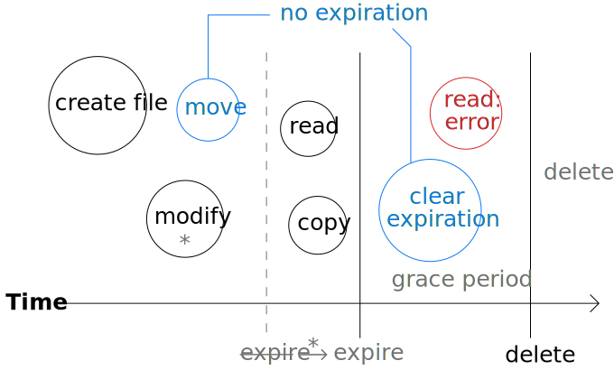

This summer, I interned on the Data Warehouse Storage team at Facebook's Seattle office. It was a great experience overall, and I'm thankful for it. In those sixteen weeks, I learned a lot about infrastructure engineering, distributed systems, and data storage technology. In this article, I'm going to focus on the main project I worked on: building a file expiration service for a distributed file system.

<!--more-->

# Background

Facebook is well known as the world's largest social networking platform. In addition to the main Facebook website, Facebook (the company) also develops Instagram, Messenger, and WhatsApp. In order to function smoothly for billions of users, these products rely on a deep and complex infrastructure stack. An important part of the infrastructure is data storage: Facebook has to store an enormous amount of data.

The more active users a service has, the more data will need to be stored. All your status updates, messages, and photos have to go somewhere. However, this type of data is only part of the story; another important part is the _data warehouse_. A data warehouse is "a large store of data accumulated from a wide range of sources within a company and used to guide management decisions."[^1] When someone wants to answer a specific question about a product, they consult the data warehouse. At Facebook, the data warehouse is essential for data scientists and data engineers. For infrastructure engineers, the question is, how do we store all that data?

Data storage is an old problem. For decades, businesses have relied on computers and hard disk drives to store and process data. Even though hard disk capacity has increased exponentially over the years,[^2] it hasn't been enough to satisfy the world's growing appetite for data. Instead of dealing with individual hard disks, companies like Facebook store data in [clusters][] of many thousands of servers and hard drives working together. This allows for greater capacity, but results in a much more complex system. To manage it all, a _distributed_ file system is needed: one that presents a single coherent file system, but internally distributes the data across the cluster.

One of the most popular distributed file systems is the [Hadoop Distributed File System][HDFS] (HDFS). Facebook uses HDFS extensively for its data warehouse, as well as related Hadoop technologies like [Hive][].[^3] However, due to scalability challenges with HDFS, Facebook formed a team to build a new distributed file system called Warm Storage; this is the team I was on. Warm Storage is designed to be an exabyte-scale storage system that solves some of the problems encountered with HDFS. An important part of its architecture is the separation of storage and compute: data is sent over the network rather than being tied to a single server, allowing storage and compute resources to be scaled independently.[^4]

Even with large data centres and powerful software, data warehouse capacity remains a challenge. There are many potential solutions to this problem: buying more resources, improving compression algorithms, or sacrificing durability by storing fewer redundant copies, to name a few. However, the simplest way to maximize space for data is to avoid wasting it in the first place. That might seem obvious, but in practice it's easy to lose track of temporary data and forget to delete it. This situation can be avoided by having software automatically delete files after a certain time has passed. This is the central feature of an expiration service.

# Design constraints

An expiration service for Warm Storage should solve the problem of forgotten temporary files taking up space. "Expiration" refers to the fact that these files will eventually expire, and then be deleted. "Service" refers to the microservice architecture of Warm Storage: the software that deletes expired files can be implemented as a separate service. At first, this might seem very simple -- all it has to do is delete files at specific times. However, there are many details that go into the design of the service, and they must all be carefully considered.

The most important criteria in the design of the expiration service are simplicity, flexibility, and predictability. Simplicity and flexibility are important for a good user experience -- the service should be simple to use but flexible enough to account for most use cases. Predictability is essential for any feature that deletes data, as data loss is just about the worst thing that can happen in a data warehouse (perhaps only data breach is worse). By "predictable," I mean it should do the right thing from the user's perspective: the user should never be surprised when their file is deleted. With these criteria in mind, I will now outline the main design constraints.

First, it must be possible to create files with expiration times, either with an absolute time ("expire at 12:00 p.m. on 13 August 2017") or with a relative time ("expire in 5 hours"). The resolution for the expiration time should be seconds, since this is most convenient for an implementation using [Unix time][], and sub-second precision is not useful. The design might also choose to allow changing expiration times on existing files, but this is not strictly necessary. Another optional feature would be to allow expiration times on directories. This could work by simply deleting the directory and all its contents once it expires, or by having files inherit the expiration time of their parent directories.

Second, the service should be aware of file modifications. For example, if you are in the middle of making changes to a file, it doesn't make sense to delete it, even if the expiration time has arrived. Similarly, if you rename a file or move it to a different directory, it probably shouldn't be deleted either. The design should specify reasonable and unsurprising behaviour for all file operations, and it should err on the side of not deleting things. In some cases, expiration should be merely delayed, while in others it should be cancelled entirely. Opening and reading a file should not count as modification -- it should be possible to open a file right up until it expires.

Third, the design should be forgiving of human mistakes. It is inevitable that people will accidentally set expiration times on the wrong files or make files expire sooner than they really should. There needs to be a way to stop a file from being deleted, either by clearing the expiration time or by copying the data to a new file. Importantly, this should work on files that have expired but have not yet been deleted by the service, so that recovery is an option until the last possible minute. To make this more useful, there should be some breathing room between expiration and deletion -- for example, by delegating the actual deletion to a different service, or by adding a fixed amount to every expiration time.

Fourth, and finally, the service needs to be efficient. This applies to the design, not just the implementation, since some designs are impossible to implement efficiently. I can't give exact numbers about Facebook's data warehouse, but the service needs to be able to handle the workload it's likely to get from the warehouse once people start using the feature. For example, listing all the files tracked by Warm Storage and then filtering the ones that have expired isn't going to work. Furthermore, it needs to be designed in a scalable way, so that heavier use can be supported by adding more resources. For example, a design that assumes a single thread of execution isn't going to work either.

These are the design constraints I came up with after thinking about the problem and discussing it with my teammates. The expiration service needs to assign expiration times to files, understand when files are modified, anticipate human mistakes, and run efficiently. With this settled, all I had to do was choose a final design and implement it, guided by a focus on simplicity, flexibility, and predictability.

# Chosen design

My first and most important design decision was to limit the expiration service to only work on files. At first, it seemed like it would be a good idea to be able to apply expiration times on directories as well. However, this proved to be more complicated than it was worth, given that it wasn't a pressing need for customers. Here are some of the questions that came up:

- What happens when you add a file to the directory? Should it push back the expiration time? What else counts as modifying a directory?
- Recursive directory deletion is not an atomic operation. What happens if a user changes the directory expiration time while deletion is in progress?
- What happens if a file has an explicit expiration time later than the directory's? Should it stay around longer than the other files? In that case, when does the service remove the directory itself?
- Should new files inherit the absolute expiration time of a directory, or the relative time (making the directory like an operating system's trash bin)?
- What are the performance implications for inheriting expiration times from ancestors far up the directory tree?

All these issues would significantly complicate the design and implementation of the expiration service, going against the goal of simplicity. More importantly, no matter what behaviour I chose, it would be difficult to make it intuitive to users. The more rules and special cases in play, the more likely users are to get confused about when things will really be deleted. By simply not supporting expiration times on directories, the service becomes easier to understand and predict. For these reasons, I decided to focus the service only on files.

Next, I chose to make the service's user-facing API deal in relative times, not absolute times. For example, when you create a file with an expiration time, you must specify it as a number of seconds in the future. This design has several benefits. First, relative times are a more natural input when creating temporary files: you should know roughly how long you want the file, not a specific date when you want it purged. Second, treating zero as "no expiration" makes more sense with relative times. It's still a special case -- it could be confused with "expire immediately" -- but it's a less jarring special case than zero in absolute time, which should really mean [midnight on 1 January 1970][Unix time]. Finally, with relative times it's easy to validate input by rejecting negative numbers. True, you could also check if an absolute time is less than the current time, but there's no guarantee that the client-side and service-side clocks are synchronized, meaning the success of "expire at the current time plus one second" would be unpredictable. Sticking with relative times makes the service more predictable and easier to use.

Another important part of the design I chose is the behaviour of  various operations on expiring files. When a file has an expiration time, all mutating operations on it reset the clock. So, if you create a file that expires in 5 hours, and then 4 hours later make changes, it won't expire until 5 hours from that modification time. The file won't expire until it has been sitting there for 5 full hours without any modifications. If you rename, move, or copy the file, the new file will not have any expiration time (but the old one will in the case of copying). There were many other operations specific to Warm Storage I had to consider, but I won't go into those details here. The main thing is that the rules are simple and predictable: modification pushes back expiration, and new files created from old ones do not retain expiration. This behaviour also makes the service more flexible, since it supports the use case of temporary files that are modified for some period of time and after that no longer needed.

The next thing I considered was the potential for (or rather, certainty of) human mistakes. While my design cannot prevent these, it does try to give users a second chance. For instance, you can change a file's expiration time whenever you want; you can create a file and set the expiration after, or you can change your mind and cancel the expiration. Once a file has expired, most operations -- including opening, reading, and writing -- return an error code saying the file has expired. But there's an exception: you can still change the expiration time, so you can recover the file before it gets deleted. Furthermore, the service has a grace period between file expiration and deletion, giving users a chance to notice their files are expired before _really_ deleting them. The grace period is configured per instance of the service, not per file, and it should usually be set to a few days. For example, if the grace period is set to 2 days, files won't get deleted until 2 days have passed since expiration. This feature, together with the ability to change expiration times, provides a simple safeguard against deleting files that are actually still needed.

Lastly, I had to think about efficiency and scalability. In order for the expiration service to work, it needs to scan files and pick out the expired ones quickly. Going through them one by one and checking would be prohibitively slow and wasteful, so it can't be implemented that way. Instead, the service uses a [key-value store][] called ZippyDB[^5] to keep track of expiration times. Specifically, it constructs a key identifying the file with a special prefix containing the absolute expiration time. ZippyDB supports retrieving a range of keys from a start prefix to an end prefix, so finding expired files is as simple as scanning from zero to the current time. ZippyDB is already used in other parts of Warm Storage, so this was an easy decision to make. Nonetheless, it was important because it imposes constraints on other parts of the design -- for example, this wouldn't work well if files inherited expiration times from directories. This part of the design allows the service to be scalable; that is, flexible enough to work at small levels and at very high levels of usage.

These are the essential parts of the design I chose. The expiration service works only on files, accepts relative expiration times from users, delays expiration when files are modified, allows expiration times to be changed, supports a grace period, and uses a key-value store. Here is an example of the operations a user might perform on a file over time, illustrating how the expiration time changes and when the grace period is active:

# Conclusion

The file expiration service I've described satisfies all the design constraints, and it respects the criteria I chose. I finished the implementation during my internship, but I didn't get it into production soon enough to get a good sense of its success and impact. Ideally, it should reduce the amount of space wasted by unneeded temporary files, which is difficult to measure -- some files deleted by the expiration service would have been cleaned up manually anyway. It should also perform well and scale smoothly to increased usage, which is much easier to judge. Since this service is a convenience for users of Warm Storage, the most important feedback will come from them: do they find it simple to use, flexible for their purposes, and  easy to predict and understand?

I didn't arrive at the final design for the expiration service just by thinking abstractly about criteria and constraints. Some of it I did decide from the beginning, but there were other parts I figured out along the way that I couldn't see from the start. And if I'm honest, some parts were influenced more by ease of implementation than by design criteria, given that I only had a limited time to finish the project. This is the nature of software engineering: it's rarely possible to come up with a perfect design in one iteration. At a certain point, you have to start building things, because a significant part of the work is discovering all the stumbling blocks and edge cases that only become apparent when you try to specify the design in a programming language. All that being said, good planning and thoughtful design are important skills, and I hope to improve them as I continue my education and career.

[^1]: "[Data warehouse][]," _Oxford Dictionary of English_, 3rd ed. Oxford UP, 2015.
[^2]: C. Walter, "[Kryder's Law][Kryder]," _Scientific American_, 1 Aug. 2005.
[^3]: P. Vagata and K. Wilfong, "[Scaling the Facebook data warehouse to 300 PB][scaling to 300]," _Facebook Engineering Blog_, 10 April 2014.
[^4]: K. Patiejunas and A. Jaiswal, "[Facebook's disaggregated storage and compute for Map/Reduce][DisAgg talk]," _Data @Scale_, June 2016.
[^5]: M. Annamalai, "[ZippyDB: A distributed key-value store][ZDB talk]," _Data @Scale_, June 2015.

[HDFS]: https://hortonworks.com/apache/hdfs/
[Hive]: https://hortonworks.com/apache/hive/
[data warehouse]: https://en.oxforddictionaries.com/definition/data_warehouse
[Kryder]: https://www.scientificamerican.com/article/kryders-law/
[clusters]: https://en.wikipedia.org/wiki/Computer_cluster
[DisAgg talk]: https://atscaleconference.com/videos/facebooks-disaggregated-storage-and-compute-for-mapreduce/
[Unix time]: https://en.wikipedia.org/wiki/Unix_time
[scaling to 300]: https://code.facebook.com/posts/229861827208629/scaling-the-facebook-data-warehouse-to-300-pb/
[ZDB talk]: https://code.facebook.com/posts/371721473024046/inside-data-scale-2015/
[key-value store]: https://en.wikipedia.org/wiki/Key-value_database
