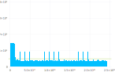
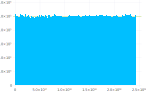

How hard can it be to shuffle a deck of cards? You may have been accused of under-shuffling a deck, but have you ever been caught _over_-shuffling? This doesn't make any sense intuitively. You would think that the situation improves the longer we shuffle -- the more randomness, the better. But what do we even mean by "better"? How do we measure shuffled-ness?

> **Edit**: Some time after writing this article, I rediscovered Jeff Atwood's blog post [The Danger of Naïveté][jeff] from 2007. I read it years ago; it was the clearly the inspiration for this article. Had I recalled it, instead of assuming I picked up the idea in some book, I probably wouldn't have written this. In any case, readers should consider this as an alternative presentation of the ideas in Jeff's article. &mdash;MK, 12 Aug. 2017

# Simple shuffle

Suppose we want to shuffle a deck of $n$ distinct cards. There are many shuffling techniques out there, but most are not defined precisely enough for our purposes. Let's go with something simple: repeated swapping. Here's an algorithm you might come up with:

1. Pick two random cards.
2. Swap the cards.
3. Repeat $n$ times.

Why $n$ times? Well, larger decks should require more shuffling, so it makes sense to depend on $n$. Here's the bad news: this is an awful shuffling algorithm. To appreciate its abysmal qualities, we need to decide what defines a good shuffling algorithm.

A shuffling algorithm takes a list of cards and produces a random permutation. With a deck of $n$ cards, there are $n$! possible permutations. A good shuffling algorithm has no bias -- each permutation is equally likely to occur. Another way of saying this is that it produces a <dfn>uniform distribution</dfn> of permutations. Let's take a look at the distribution produced by the simple shuffling algorithm on a deck of 20 cards:[^1]



There are 2,432,902,008,176,640,000 ways of shuffling 20 cards. This histogram divides them up into 200 bins on the x-axis. I used a million samples -- that's the number you get if you add up the heights of all the bars. The green line represents a uniform distribution. It's at 5000 because if each bin had 5000, then the 200 bins would have 1,000,000 together.

Now, that's pretty bad! There's a huge bias at the beginning. And what's up with those periodic spikes? The simple shuffling algorithm might seem to work, but in fact some permutations are far more likely than others. You could actually take advantage of this to get an unfair advantage in a game! The first permutation in the histogram is in ascending order, and the last is in descending order. Given that lower permutations are significantly more likely, meaning the cards are in roughly ascending order, you could give yourself a better hand by always dealing for yourself last. Of course, I am assuming the deck is sorted before the game begins.

If you know anything about generating random numbers on computers, you might object at this point. How do we know the nonuniform distribution is the fault of the algorithm, and not of the pseudorandom number generator I'm presumably using for step 1 of the algorithm? I wasn't sure, so I decided to eliminate this variable entirely by drawing the numbers from a perfectly uniform list that I prepared in advance.[^2] Whereas the pseudorandom numbers had an approximately uniform distribution, my list was perfect: each number had an identical number of occurrences. The new graph turned out to be indistinguishable from the old one.

# Fisher--Yates shuffle

The correct algorithm is actually very simple. It's much easier to see if we think of building up a new deck rather than shuffling the deck in-place. Here's the algorithm, once again in three steps:

1. Remove a random card from the deck.
2. Stack it elsewhere.
3. Repeat until no cards are left.

Fisher and Yates described this method in 1938, showing that it results in an unbiased permutation. It was a bit more complicated than this because they were talking about shuffling data with pen and paper, not shuffling physical cards. Something along these lines:

1. Write down the numbers 1 to $n$.
2. Pick a random one of the numbers.
3. Strike it out and write it down elsewhere.
4. Repeat until all numbers are struck out.

The algorithm seems just as simple as the "simple shuffle," but the reason most people wouldn't come up with it immediately is that it's a bit trickier to implement in code. It's important to notice that the set of cards you're drawing from is always shrinking, so the range of your random numbers should be shrinking too.

# Knuth shuffle

The Fischer--Yates shuffle is also referred to as the Knuth shuffle because Donald Knuth included it in <cite>The Art of Computer Programming</cite>. He had computers in mind, not paper, so this version of the algorithm is more relevant for us:

1. Start at the first card.
2. Choose a random card between that one and the last card.
3. Swap the cards.
4. Repeat from step 2 with the next card.

Try to convince yourself that this is equivalent to the Fisher--Yates algorithm (it is). We could have instead implemented it by literally building up a new deck in memory, but Knuth's method is more efficient than that because it shuffle in-place. Here's the distribution we get, once again using 20 cards, 200 permutation bins, and a million samples:



Much better! The distribution is not perfectly uniform, but it is very close. If we used a trillion samples instead of a million, the histogram would probably look like a solid rectangle. Also, keep in mind that this graph is zoomed in on the $y$-axis quite a bit more than the other one, since it doesn't have to show that huge spike at the beginning. In any case, there is no sign of bias in the variation here, and that's the important thing.

# Identifying permutations

The most difficult part of analyzing these distributions was identifying the permutations. I used a million samples, so I shuffled a deck a million times. You can't graph decks on the x-axis, though, so I had to assign a unique integer to each possible permutation.

I arbitrarily decided that ascending order would correspond to zero and descending order would have the highest value, $n!-1$. Here's what the mapping should look like for $n=3$:

| permutation | value | FNS |
| ----------- | ----- | --- |
| 0, 1, 2     | 0     | 000 |
| 0, 2, 1     | 1     | 010 |
| 1, 0, 2     | 2     | 100 |
| 1, 2, 0     | 3     | 110 |
| 2, 0, 1     | 4     | 200 |
| 2, 1, 0     | 5     | 210 |

It just so happened that I recently read about the [factorial number system][fac]. This is essentially what we have here, but with a twist: the digits don't count for their literal value -- you have to subtract the number of integers below that have already been used. This corresponds to the striking-out step in the Fisher--Yates algorithm. If you make that change, you get the numbers I placed in the "FNS" column. That's how you count in the factorial number system. One peculiarity of this system is that the rightmost digit is always zero. This makes perfect sense in our case, because a permutation is completely determined once you get to the second-to-last item -- there is only one choice for the last one!

Here's how I would implement this in C:

```c
int permutation_number(int deck[], int n) {
    // Allocate the auxiliary array and initialize everything to 1.
    int *available = (int *)malloc(n * sizeof(int));
    for (int i = 0; i < n; i++) {
        available[i] = 1;
    }

    int pn = 0; // permutation number, the value we're calculating
    int f = factorial(n-1); // factorial multiplier for the current digit

    // Only loop to n-1 because the last iteration would just add zero.
    for (int i = 0; i < n-1; i++) {
        int val = deck[i];

        // Count how many unused cards occur before this one.
        int pos = 0;
        for (int j = 0; j < val; j++) {
            pos += aux[j];
        }

        n += pos * f; // add the factorial digit value
        aux[val] = 0; // strike out the card
        f /= N-i-1; // change the factorial multiplier
    }

    free(available);
    return pn;
}
```

# Julia & Gadfly

I performed the shuffling simulations and did the permutation analysis for this article using [Julia][jl], an excellent new language for numerical and scientific computing. To produce the graphs, I used the library [Gadfly][gf]. Julia has become my go-to language for quick simulations, pretty visualizations, and anything math-heavy. It's also great for solving problems in coding competitions. It's expressive and easy to use like Python, but much faster, and more inclined towards mathematics.

This is my time writing an article on a particular algorithm. I've decided to host the code I write for them [on GitHub][al]. To get a sense of what Julia code is like, take a look at the file [shuffle.jl][sh]. I recommend using [Juno][juno], an IDE for Julia based on Chris Granger's [LightTable][lt]. It will show you the Gadfly graphs inline, and you can even drag on the numbers (for example, the size of the deck or the number of samples) to see the graph change in real time!

The reason I included the permutation algorithm above in C rather than using my Julia implementation is that Julia uses one-based indexing, which makes that function harder to understand if you aren't used to it. Apparently one-based indexing (using 1 as the first index) is more common in mathematical software -- Mathematica uses it, for example -- but it still feels a bit strange to me. That being said, this is only a minor annoyance, and it certainly shouldn't stop you from trying out Julia.

# Conclusion

The unexpected failure of the simple shuffle demonstrates that we have high self-confidence mismatched with poor ability when it comes to intuitive statistical analysis. We are pattern-seeking animals, and we have a very hard time recognizing a truly random experience. It feels like a bit of randomness should be the only required ingredient, but in reality we need precise quantities in the right places if we want to avoid bias. The Fisher--Yates algorithm shuffles an ever-shrinking subset of the deck, so in a sense it is doing less shuffling than the simple shuffle. In order to get the desired uniform distribution, we have to confine the randomness.

[^1]: Why 20 cards? Because 20 is the largest number whose factorial fits in a 64-bit integer, and I didn't feel like using arbitrary-precision integers.

[^2]: At first I tried a repeating sequence of the integers modulo 20, but with that change, every shuffle was identical. The solution was to _shuffle_ that sequence, introducing randomness while maintaining the uniform distribution.

[jeff]: https://blog.codinghorror.com/the-danger-of-naivete/
[fac]: https://en.wikipedia.org/wiki/Factorial_number_system
[gf]: https://gadflyjl.org
[jl]: https://julialang.org
[al]: https://github.com/mk12/algorithms
[sh]: https://github.com/mk12/algorithms/blob/main/shuffle.jl
[lt]: http://lighttable.com
[juno]: https://junolab.org
