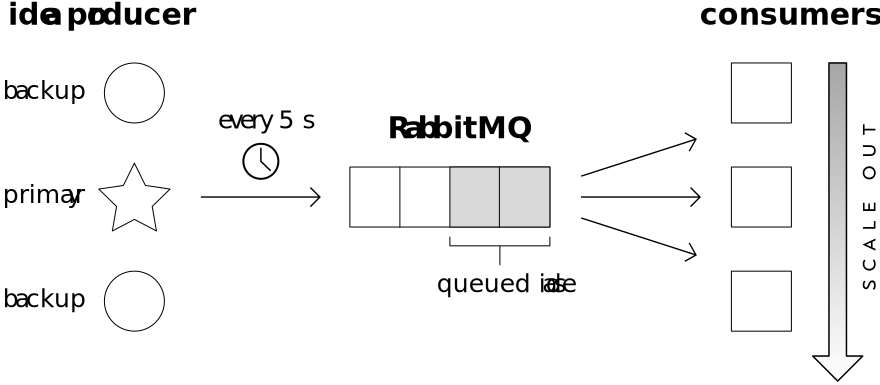
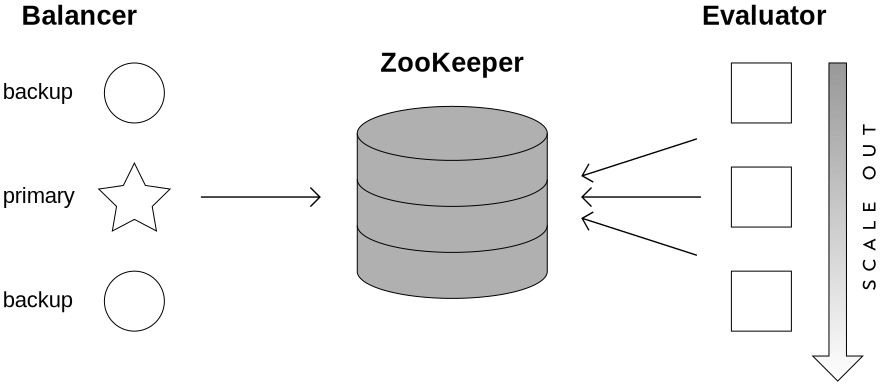

This winter, I interned at Bloomberg in New York City. During my time there, I was on an engineering team called Foreign Exchange Idea Generation. I had the chance to work on several interesting projects, and I also learned a bit about the foreign exchange market. In this post, I'm going to discuss one particular problem I worked on: horizontally scaling a real-time pricing engine.

# Background

Bloomberg is a financial software and media company. Its main product, the [Bloomberg Terminal], provides access to news, data, and trading tools for hundreds of thousands of customers around the world.[^1] Many features of the Terminal are organized around different markets, such as stocks, bonds, and currencies. My team is concerned with that last category -- the foreign exchange market, or FX for short.

One system FX Idea Generation works on is a paper trading platform that allows users to share trade ideas. For example, a user might create an idea to go long on USD and short on CAD, and then track the results of that hypothetical investment over time. This system, as well as many other FX tools at Bloomberg, relies on a <dfn>pricing engine</dfn>: a program that makes price calculations based on real-time currency data. I will refer to this particular pricing engine as the Evaluator.

The Evaluator's job is to go through all the open trade ideas and calculate various data points, such as spot return and carry return, based on the latest prices. It does this continually during market hours -- which, for the [global FX market], means 24 hours a day except from Friday afternoon to Sunday afternoon. Currently, the Evaluator uses a primary-backup architecture. This means there are multiple machines running it, but only one is active at a time; the others are only there to take over if the primary goes down.

# Problem statement

The current design of the Evaluator does not meet scalability needs. In order to support higher load -- more ideas, more frequent pricing -- we would eventually need to scale up, buying machines with faster processors and more memory. Scaling <dfn>vertically</dfn> like this is undesirable because it's wasteful and unnecessarily expensive. It requires us to upgrade all the machines, even though most of them are only there for redundancy. We already have enough combined computing power; we just need to use it more effectively.

We can address this problem by moving to a horizontal scale-out architecture. By <dfn>horizontal</dfn>, I mean a design that distributes calculations across the cluster instead of performing them all on one machine. This would provide scalability, since we could easily add more machines; fault tolerance, since we could redistribute the work if one node goes down; and better hardware utilization, since all machines would be doing useful work. Horizontal scaling is not always the answer, but in this case it's almost a no-brainer: all calculations are independent, so communication is only needed for dividing up the work.

There are many ways this system could be designed. The goal is simple, but the details are hard. What technology do we use? How do we divide up the work, and how do we assign tasks to machines? What happens when a machine fails unexpectedly? Which parts of the system communicate with each other, and what happens if they lose connection? An acceptable solution must deal with all these questions.

# Design constraints

Before offering possible solutions, I will first explain how to judge them. For this project, the most important criteria are simplicity, reliability, and reusability. It should be simple, because simpler systems are easier to understand and maintain; reliable, because failures at the level of coordinating the system could have big consequences; and reusable, because many other systems could benefit from a generic solution. That being said, some amount of complexity is necessary for it to be correct, and some failures can only be anticipated and tolerated, not eliminated. Reusability is important, but it doesn't justify adding features the Evaluator doesn't need.

In addition to those criteria, there are some constraints on the design. First, the project must provide a C++ interface, since the Evaluator is written in C++. Second, the system must be easily testable in isolation: it should not be tightly coupled to the Evaluator. Third, the system cannot assume an unchanging set of ideas, since users can add and remove trade ideas at any time. Finally, the project must use mature, proven technologies -- implementing a brand new consensus algorithm from scratch, for example, is not an option. Any solution that meets all these constraints is on the right track and worth considering.

# RabbitMQ solution

[RabbitMQ], developed by [Pivotal Software], is an open source message broker: a platform for sending and receiving messages in a distributed system. Using RabbitMQ, we can design a system that distributes the work of the Evaluator across multiple nodes. Specifically, we can treat each idea evaluation as a separate work item, and continually distribute them by pushing them onto a RabbitMQ queue. This approach relies on the fact that the Evaluator is a low volume pricing engine: it only needs to evaluate each idea once every few seconds, even though the underlying prices can update much more often than that.

The first step is to split the Evaluator into two parts: a producer, which decides what ideas needs to be evaluated, and a consumer, which takes the ideas and evaluates them. The fundamental assumption of this design is that only the consumer needs to scale -- only the CPU and I/O resources involved in evaluating ideas, not the process of iterating through all the ideas and handling the arrival of new ones. Therefore, to scale out to support more ideas, we simply add more consumers. The producer, like the original design of the Evaluator, uses a primary-backup setup to ensure reliability.

In this scheme, the producer goes through all ideas every few seconds and pushes them onto the queue if they need evaluation. (We don't evaluate ideas if the underlying prices haven't changed significantly enough.) RabbitMQ will then dispatch the items to the consumers in round-robin fashion, the way you would deal cards in a card game. Each idea will probably get evaluated by a different consumer each time, so all the consumers must be prepared to handle any idea. Since we only evaluate every few seconds, the latency of going from producer to queue to consumer is acceptable. There's nothing to worry about if a consumer machine goes down -- the remaining consumers will just have a higher load.

This solution meets all the design constraints. RabbitMQ has clients for many programming languages, including C++, so it would be easy to integrate with the existing codebase. The producer and consumer are decoupled by the queue, and they can each be tested in isolation. It would also be possible to implement the new functionality as a reusable library, so that specific pricing engines only need to fill in the logic for choosing work items and carrying out the work. This design has no trouble with a changing set of ideas: if a user adds an idea, the producer can enqueue it on the next iteration. Finally, RabbitMQ is a mature, battle-tested piece of software, so we can rely on it with confidence.

# ZooKeeper solution

[Apache ZooKeeper] is an open source coordination service for distributed systems. It does many things, including "maintaining configuration information, naming, providing distributed synchronization, and providing group services."[^2] We can use ZooKeeper to distribute ideas among Evaluator instances, but differently from the RabbitMQ solution. Instead of continually pumping ideas through the system, we can distribute the ideas once at the start, and only redistribute when new ideas arrive or when the set of instances changes. The Evaluator doesn't need to change much -- it just needs to read the list of ideas it's responsible for from ZooKeeper. The challenge then becomes designing the component that writes this information to ZooKeeper.

Every ZooKeeper service is replicated across a set of machines called an <dfn>ensemble</dfn>. For our purposes, though, we can ignore this and treat it as a  black box. On one side, we have the set of Evaluator instances that register themselves in ZooKeeper and then read the list of ideas assigned to them. On the other side, we have a new piece: the Balancer. The Balancer is responsible for recognizing the instances registered in ZooKeeper and partitioning the set of ideas among them. This "registering" and "assigning" is done by manipulating ZooKeeper <dfn>znodes</dfn>, which are pieces of data arranged in a hierarchy similar to a filesystem. For example, there could be a znode for each Evaluator instance, and underneath them a znode for each idea they own. Like the producer in the RabbitMQ solution, the Balancer has to run in primary-backup mode in case of failures.

When the primary Balancer starts up, it loads all the ideas and checks to see if any Evaluator instances have registered themselves. If so, it divides up the ideas evenly among them and writes znodes to indicate the assignment. The Evaluator instances, which were waiting for this to happen using ZooKeeper's <dfn>watch</dfn> feature, can then start evaluating those ideas. Whenever a new idea is created, the Balancer assigns it to a random instance. At the same time, it continues to watch the znodes for each instance; these are <dfn>ephemeral</dfn> znodes, meaning they disappear if the machine that created them loses connection to the ZooKeeper ensemble. So, if an Evaluator instance goes down, the Balancer will recognizes this and redistribute the ideas among the remaining instances.

This solution also satisfies all the design constraints. ZooKeeper is written in Java, but it can be accessed from many other languages, including C (and therefore C++). The Balancer can be tested in isolation of the Evaluator, and we could implement a generic framework that refers to _tokens_ instead of _ideas_ to make it more reusable. The Balancer handles the changing set of ideas by assigning new ones to a random Evaluator instance. Lastly, ZooKeeper is stable and mature -- it is used by many notable projects, including [Hadoop], [HBase], and [Kafka].

# Chosen design

After considering both options, I decided to proceed with the ZooKeeper design. There were several factors that influenced this decision, including objective analysis of the designs as well as more practical concerns, like what other teams were doing. In this section, I will describe the former part: why the ZooKeeper solution, as presented here, is better. Both options stacked up well to the design constraints, so to justify this claim I will turn to my design criteria: simplicity, reliability, and reusability.

Both options make the Evaluator more complicated than it currently is. This is unavoidable. However, they increase its complexity in different ways. Looking at the static configuration, they are similar: both have a primary-backup component, a collection of worker nodes that can scale out, and a distributed systems technology in the middle. But when we consider the dynamic behaviour, they are quite different. In the RabbitMQ solution, the components are constantly communicating via the queue. Consider tracing the life cycle of a single idea: it would be difficult, since the idea could be evaluated by a different consumer every time. In the ZooKeeper solution, communication is kept to a minimum. The behaviour of an individual Evaluator instance is almost the same as the original Evaluator; it's just responsible for fewer ideas. The two main tasks -- partitioning ideas and evaluating them -- are fully separated. For these reasons, the ZooKeeper solution, though not necessarily leading to a simpler implementation, is a simpler design.

Reliability is the second important criterion. If we consider RabbitMQ and ZooKeeper to be equally reliable at performing their respective tasks -- a reasonable assumption -- then we need to compare the types of failure and unreliability that might occur outside those technologies. One advantage of the RabbitMQ solution is that double evaluation or skipped evaluation is unlikely. With the ZooKeeper solution, it's easier to imagine a race condition where an idea is temporarily assigned to two instances or to none. On the other hand, the ZooKeeper design is more tolerant to failure in its primary-backup component. If the Balancer fails and electing a new primary takes a long time, for example, the Evaluator instances will simply continue to evaluate the ideas they were evaluating before. But if a similar thing happens to the producer in the RabbitMQ design, the system will come to a halt because no ideas are being produced. There are many other scenarios we could consider, but based on this I conclude that neither option is significantly more reliable than the other.

The distinction between the two designs is clearest on reusability. The final product ought to be reusable at least with other pricing engines, if not on a broader scope. This is unlikely with RabbitMQ design because of two assumptions it makes: that there are "ideas" independent from the incoming [price ticks], and that the producer doesn't need to scale. The problem with the first assumption is that not all pricing engines operate like the Evaluator, with an evaluation schedule independent from the currency data. Instead, many pricing engines generate output every time a price change comes it, which can happen at a very high frequency -- too high to send them all through a queue. The problem with the second assumption is simple: what if there are so many "ideas" that one producer can't keep up? This wouldn't be an issue in our case, but it limits the reusability of the solution. The ZooKeeper solution is more general: it can partition the work based on any token, whether it's an idea number, a currency code, or something else. It makes fewer assumptions about the task being scaled.

Based on these criteria, the ZooKeeper design is more promising. Implemented properly, it should result in a (relatively) simple, reliable, and reusable framework for horizontally scaling pricing engines. That isn't guaranteed, though -- the real test will come when a prototype is finished and we can measure its results with the Evaluator's workload.

# Conclusion

Both solutions presented here are viable. The RabbitMQ design is more specific to our use case, and would probably be easiest to implement. The ZooKeeper design is more general, but it might take more work to implement it correctly. Either way, we wouldn't have to start from scratch: our team tried a variant of the RabbitMQ design before but didn't finish it, and another team already started work on a framework using ZooKeeper. For last month or so of my internship, I worked that existing framework, generalizing and improving it to match the design I've described here. In particular, I focused on creating automated tests to simulate conditions such as a machine failing unexpectedly. Since this was my second project and I had limited time left, I wasn't able to finish everything, but I did as much as I could.

This was my first time designing a distributed system. I've worked on pieces of distributed systems before, but I'd never made decisions about how they should be architected, or investigated technologies for communication and coordination like RabbitMQ and ZooKeeper. I find it interesting and challenging, and I look forward to learning more about it when I take [ECE 454 Distributed Computing] this spring term at Waterloo.

[^1]: "[The Terminal](https://www.bloomberg.com/professional/solution/bloomberg-terminal/)," _Bloomberg Professional Services_, 3 May 2018.
[^2]: "[General Information](https://cwiki.apache.org/confluence/display/ZOOKEEPER/Index)," _Apache ZooKeeper Wiki_, 3 May 2018.

[Bloomberg Terminal]: https://www.bloomberg.com/professional/solution/bloomberg-terminal/
[global FX market]: https://en.wikipedia.org/wiki/Foreign_exchange_market
[RabbitMQ]: https://www.rabbitmq.com/
[Pivotal Software]: https://pivotal.io/
[Apache ZooKeeper]: https://zookeeper.apache.org/
[Kafka]: https://kafka.apache.org/
[HBase]: https://hbase.apache.org/
[Hadoop]: http://hadoop.apache.org/
[price ticks]: https://en.wikipedia.org/wiki/Tick_size
[ECE 454 Distributed Computing]: http://www.ucalendar.uwaterloo.ca/1819/COURSE/course-ECE.html#ECE454
