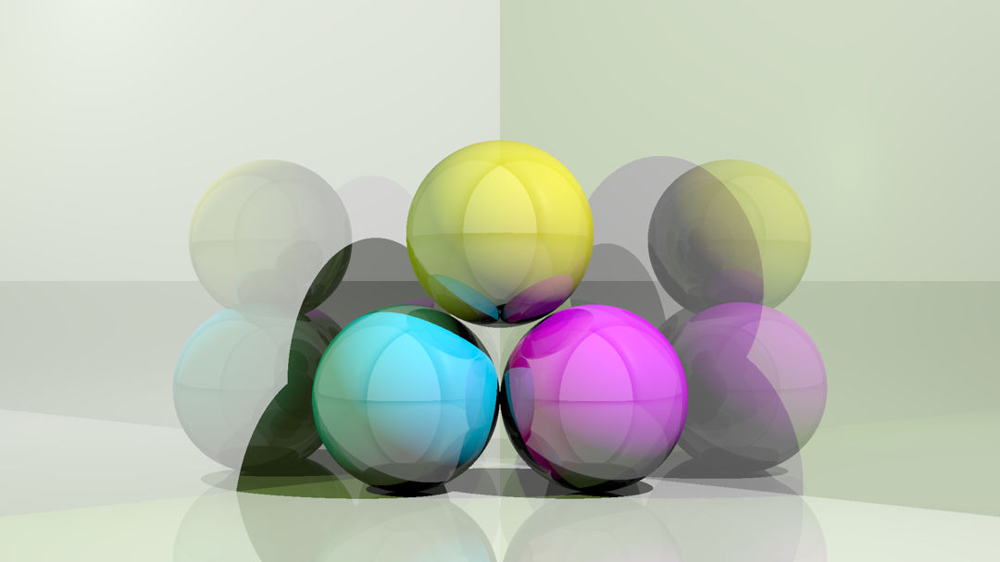
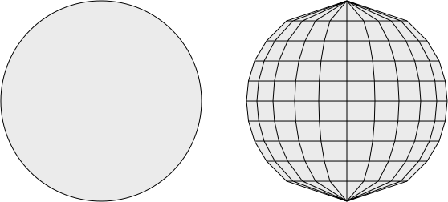
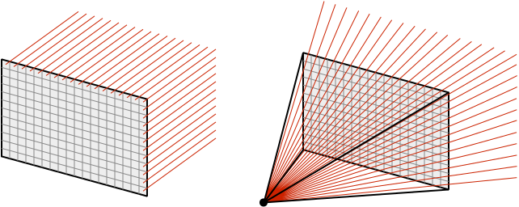
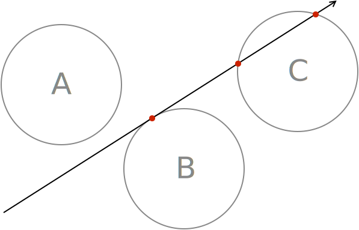
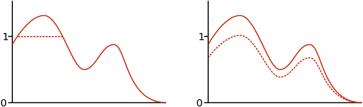
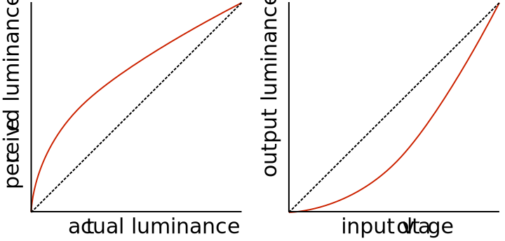

In the summer of 2012, I wrote a ray tracer called [Luminosity](https://github.com/mk12/luminosity) as my first Haskell project. I've worked on other things since, but Luminosity remains my favourite project. If you're itching to write some code but, after googling "coding project ideas," digging up that Asteroids clone you never finished, combing through lists of open source projects---still find yourself in a painful discombobulation---then I suggest writing a ray tracer. <!--more--> The algorithm itself is surprisingly simple, but there are many other details to consider before you can start rendering images. Once those issues are tackled, though, the end results are very rewarding.

# Overview

Ray tracing is a method of _rendering_, which converts three-dimensional scenes into two-dimensional images. It is used by software such as [Blender][bl] to render still images as well as animated movies (which are simply many still images strung together). Rendering is also important in video games, but quality ray tracing is usually far too slow to maintain one frame per second, much less 60 frames!

The ray tracing algorithm computes the colour of each pixel in the image independently of the others.[^1] Imagine the image comes from a rectangular camera sensor placed in the scene, so that all colour information is due to rays of light hitting the sensor elements. If we assume that all light originates from a finite set of light sources in the scene, we can determine the image formed on the sensor by backtracking the light.

We begin with a ray on the sensor pointing towards the scene. We follow the ray in a straight line until it intersects with an object---this is the object seen at that particular pixel in the image. A separate algorithm determines the colour produced by the interaction of each light source with the object material. If the object is reflective, we bounce the ray off it and repeat. This method realistically simulates the way light interacts with materials such as glass and polished metal.

# Rays and surfaces

A _ray_, also known as a half-line, is a line that extends to infinity in only one direction. It can be represented by two vectors: a position vector for the initial point, and a unit vector for the direction. A _surface_ is technically a two-dimensional topological manifold in $\mathbb{R}^3$. For example, the unit ball $B=\{\vec{x}\in\mathbb{R}^3:\lVert\vec{x}\rVert\le1\}$ is a solid, not a surface, but its boundary, the (hollow) unit sphere $\partial B=\{\vec{x}\in\mathbb{R}^3:\lVert\vec{x}\rVert = 1\}$ _is_ a surface. This may seem like a pointless distinction since you can't tell if the sphere is hollow or not from an image, but it's worthwhile to keep in mind that you must explicitly model the surface of an object. If you leave a hole in the panelling, the ray tracer will be able to see the interior of a hollow shell.

There is no limit to the kinds of surfaces we could dream up. I'm going to use planes and spheres as examples, but why stop there---what about the cylinder, torus, [Gabriel's Horn][gh], ... ? In practice, most rendering engines stop even earlier, before the sphere. Instead of implementing special procedures to handle every kind of mathematical surface, they deal only with triangular and quadrilateral sections of planes (commonly referred to as "tris" and "quads"). All surfaces can be approximated by a _mesh_ of these small polygons. Although a perfect sphere looks better and is computationally cheaper than a spherical mesh with a high polygon count, in general it's not worth the effort because perfect mathematical objects are rare. In fact, it's often the imperfections---even photographic flaws such as chromatic aberration---that make a render photorealistic. On the other hand, a "too perfect" image immediately arouses suspicion.

All that being said, I'm sticking with planes and spheres because that's what I used in Luminosity. We can describe a plane by its normal vector and a scalar, as in $\{\vec{x}\in\mathbb{R}^3:\vec{x}\cdot\hat{n}=d\}$. Similarly, a sphere is defined by the position of its centre and its radius: $\{\vec{x}\in\mathbb{R}^3:\lVert\vec{x}-\vec{c}\rVert=r\}$. These position vectors are all relative to some global origin for the scene.

# Cameras

The role of the camera is to assign a ray to each pixel of the image. There are two main ways of doing this. First, there are _orthographic_ cameras, where all rays are parallel to each other and normal to the imaginary sensor rectangle. This means that objects do not seem bigger or smaller when they move closer or farther from the camera, which is obviously not how real cameras or eyes work. However, the orthographic projection is useful for practical (rather than aesthetic) reasons, for example in CAD software. The other main type of camera is the _perspective camera_, where in addition to the sensor rectangle there is a focal point behind its centre. The focal point can be described either by a focal length or an angle of view; longer focal lengths correspond to narrower angles. The direction of each ray is determined by the line passing through the focal point and the pixel. This means the rays diverge as they go out, encompassing an increasing area, which is why an object of constant size appears smaller when it is further away---it takes up a smaller fraction of the cross section of rays that ultimately converge on the focal point.

# Intersections

At the heart of the ray tracer is the intersection routine. We need to calculate the point of intersection made by a ray and a surface, which amounts to solving a system of two equations. The ray tracer will find millions of intersections in the course of rendering a single image, but we only need to write one function per type of surface.

We represent the ray by the equation $\vec{x}=\vec{p}+t\hat{v}$ for all $t \ge 0$. To find the point of intersection, we equate this to a general point on the surface and then solve for $t$. For the plane, we have $(\vec{p}+t\hat{v})\cdot\hat{n}=d$. Rearranging this, we get the solution

$$t = \frac{d-\vec{p}\cdot\hat{n}}{\hat{v}\cdot\hat{n}}.$$

If the answer is negative, then the ray is directed away from the plane, so the other half of the half-line is intersecting the plane. I've chosen to treat surfaces as double-sided, meaning there is no distinction between the inside and the outside as far as intersection goes. As a result, it shouldn't matter if we negate the normal vector. If we negate $\hat{n}$, then we have to negate $d$ as well to represent the same plane; and if we make these substitutions in the equation for $t$, the negatives cancel out, as expected. Also, we must be careful not to divide by zero when $\hat{v}\cdot\hat{n}=0$, which occurs when the ray is parallel to the plane.[^2]

The ray--sphere intersection is a bit harder. We begin by substituting the equation of the ray: $\lVert\vec{p}+t\hat{v}-\vec{c}\rVert=r$. Squaring both sides and using the dot product, we get $(\vec{p} + t\hat{v}-\vec{c})\cdot(\vec{p} + t\hat{v}-\vec{c})=r^2$, which reduces to the quadratic $t^2 + 2\hat{v}\cdot(\vec{p}-\vec{c})t + \lVert\vec{p}-\vec{c}\rVert^2=r^2$. The quadratic formula gives zero, one, or two solutions, since the ray either misses the sphere, touches a point tangentially, or enters by one point and exits by another. Again, we do not allow negative solutions.

# Light and shadow

Once we've found the closest intersection, we calculate the light contribution due to each light source. There are many ways of doing this; I'm going to use the Lambert shading algorithm for its simplicity. It models diffuse reflection by

$$I_D = RI_L\hat{L}\cdot\hat{n},$$

where $R$ is the reflectivity of the surface material (zgro for black, one for white), $I_L$ is the intensity of the light at that point, $\hat{L}$ goes from the point towards the light source, and $\hat{n}$ is normal to the surface. The resulting $I_D$ is the diffuse light scattered in all directions from the point. We calculate the intensity for each colour channel independently, so in RGB we have to calculate three products. Notice that the dot product in the Lambert equation causes maximum reflectance when the light source is straight on like the midday sun, and minimum reflectance when it is like a sunrise or sunset. If the result is negative, we treat it as zero, because the light rays are coming from behind the surface.

To handle shadows, we create a ray from the point on the surface directed towards the light source. If there is an intersection before the light source, then the point is in the shade. That's it! Because we are modelling light the way it works physically, shadow calculations are beautifully simple. The shadows we get are very crisp, which can be a good thing---but shadows are often blurry around the edges, and we may wish to capture that. The issue here is with our light sources.

There are three common models for light sources. The first is a point source, whose intensity follows an inverse-square falloff. The second is called an infinite source or directional light, and it consists of parallel rays of uniform intensity coming from infinitely far away. The third is a spotlight, which is like a point source but limited to a conic volume, and possibly fading out as the rays get further away its principal direction. These are all useful in lighting three-dimensional scenes, but they are not very realistic. For example, a light bulb appears to be a point source, but it is really better modelled as infinitely many point sources of infinitesimal intensity distributed throughout the volume of a bulb. We can achieve blurry shadows this way, at the cost of much more complex calculations.

# Exposure and gamma correction

Once we've calculated the colours of all the pixels, we're still not done. The values we write to disk will ultimately be in the 8-bit-per-channel format, which divides each channel into 256 shades. We need to map the intensities to the range [0,255] and round to the nearest integer---this is where we control the _exposure_ of the image. There are two simple ways we can do this: by clipping all colours greater than some arbitrary maximum, or by moving the white point to make all intensities fit in the target range.

Finally, before rounding and storing the bytes, we need to apply _gamma correction_. It turns out that the human eye perceives light in a nonlinear way: we can distinguish many more colours in the darker end of the spectrum than in the lighter end. For this reason, it makes sense to devote more than half of the 256 values to intensities under 50% grey. We do this by gamma encoding, which means applying a function of the form $c\mapsto c^\gamma$ where $\gamma < 1$. Now, it also turns out that the output luminance of CRT monitors varies nonlinearly with the input voltage. By a happy coincidence, it is a gamma function with $\gamma > 1$ and it approximates the inverse of our gamma encoding function. So, at least in the early days of television, there was no need to undo the gamma compression---the display did it naturally! Nowadays, we still store images with gamma compression, but the path from RGB value to voltage across an LCD pixel is not so simple.

With Luminosity, I used the ubiquitous sRGB color space. The transformation from linear to sRGB is almost a gamma function, but not quite because it includes a linear part at the beginning to avoid having infinite slope at the origin. We can define it as a piecewise function:

$$f(c)=\begin{cases}12.92c & \text{if}\;c \le 0.0031308;\\ 1.055c^{\frac1{2.4}}-0.055 & \text{otherwise.} \end{cases}$$

# Conclusion

You now have almost all the tools you need to make a ray tracer. It may seem like a lot, but if you look at the source code for [Luminosity][lum] you'll see that it's actually pretty short. Once you've implemented vectors, rays, surfaces, intersection functions, cameras, exposure and gamma functions, scene parsing, and the image output routine (which is admittedly quite a bit of work altogether), the ray tracing algorithm itself will just be a few lines. After that, there's still many more features you can work on: oversampling (antialiasing), specular reflection, textures, and normal mapping, to name a few. If you're still not satisfied with your ray tracer, I recommend reading up on Monte Carlo path tracing---and definitely check out [smallpt][sp], a global illumination path tracer written in 99 lines!

[^1]: This makes it very easy to parallelize---for example, a quad-core processor could simply have each core working on a different quadrant of the image.

[^2]: There are either zero or infinity intersections in this case. It makes sense to just return a negative value in both cases, unless you really want to see a paper-thin line when the camera is precisely aligned inside a plane.

[bl]: http://www.blender.org
[gh]: http://en.wikipedia.org/wiki/Gabriel's_Horn
[lum]: https://github.com/mk12/luminosity
[sp]: http://www.kevinbeason.com/smallpt/
